# Sistema de Detección de Fraude en Tiempo Real


Este proyecto implementa un sistema de detección de fraude en tiempo real utilizando Kafka para el procesamiento de eventos, Flask para la API REST, y TensorFlow para el modelo de machine learning.

## Arquitectura del Sistema

```mermaid
graph LR
    A[Cliente] -->|Envía transacción| B[API Flask]
    B -->|Publica en Kafka| C[Topic: transactions]
    C --> D[Consumer: Preprocesamiento]
    D -->|Datos limpios| E[Topic: preprocessed-transactions]
    E --> F[Consumer: Modelo ML]
    F -->|Predicción| G[Topic: fraud-results]
    G --> H[Consumer: Base de Datos]
    H --> I[(SQLite)]
    I --> J[Dashboard]
```



## Características Principales

- 🚀 Procesamiento en tiempo real con Kafka
- 🤖 Modelo de detección de fraude con TensorFlow
- 📊 Panel de monitoreo integrado
- 🔄 Pipeline de datos completamente automatizado
- 🔒 Persistencia de mensajes para recuperación ante fallos
- 📈 Escalabilidad horizontal mediante consumidores paralelos

## Prerrequisitos

- Python 3.9+
- Kafka 3.9+
- Java 8+ (para Kafka)
- pip (gestor de paquetes Python)

## Instalación y Configuración

1. **Clonar el repositorio:**
   ```bash
   git clone https://github.com/tu-usuario/fraud-detection-system.git
   cd fraud-detection-system
   ```

2. **Crear entorno virtual:**
   ```bash
   python -m venv venv
   source venv/bin/activate  # Linux/Mac
   venv\Scripts\activate     # Windows
   ```

3. **Instalar dependencias:**
   ```bash
   pip install -r requirements.txt
   ```

4. **Iniciar servicios de Kafka:**
   ```bash
   # Terminal 1: Zookeeper
   bin/zookeeper-server-start.sh config/zookeeper.properties
   
   # Terminal 2: Kafka Broker
   bin/kafka-server-start.sh config/server.properties
   
   # Crear topics necesarios
   bin/kafka-topics.sh --create --topic transactions --bootstrap-server localhost:9092
   bin/kafka-topics.sh --create --topic preprocessed-transactions --bootstrap-server localhost:9092
   bin/kafka-topics.sh --create --topic fraud-results --bootstrap-server localhost:9092
   bin/kafka-topics.sh --create --topic fraud-dlq --bootstrap-server localhost:9092
   ```

## Ejecución del Sistema

1. **Entrenar el modelo inicial:**
   ```bash
   python train_model.py --samples 15000 --epochs 20
   ```

2. **Iniciar la API Flask:**
   ```bash
   python app.py
   ```

3. **Iniciar el consumidor de Kafka:**
   ```bash
   python kafka_consumer.py
   ```

4. **Iniciar consumidores adicionales (opcional):**
   ```bash
   # En terminales separadas
   python kafka_consumer.py
   ```

## Uso del Sistema

### Enviar una transacción
```bash
curl -X POST http://localhost:5000/transaction \
  -H "Content-Type: application/json" \
  -d '{
    "user_id": "user123",
    "amount": 1500.00,
    "merchant": "ElectronicsStore",
    "timestamp": "2023-10-05T14:30:00Z",
    "merchant_type": "online",
    "device_type": "mobile",
    "location_match": 0
  }'
```

### Consultar resultados
```bash
curl http://localhost:5000/transaction/<transaction_id>
```

### Panel de monitoreo
Accede al dashboard en: http://localhost:5000

## Estructura del Proyecto

```
fraud-detection-system/
 ├── app.py                  # API Flask principal
 ├── kafka_producer.py       # Productor de Kafka
 ├── kafka_consumer.py       # Consumidor de Kafka
 ├── fraud_model.py          # Modelo de detección de fraude
 ├── preprocessing.py        # Preprocesamiento de datos
 ├── database.py             # Manejo de base de datos
 ├── model.py                # Integración del modelo
 ├── train_model.py          # Script de entrenamiento
 ├── requirements.txt        # Dependencias
 ├── README.md               # Documentación
 └── static/                 # Recursos estáticos
     └── styles.css          # Estilos CSS
```

## Mejoras Futuras para Producción

### 1. Seguridad y Autenticación
- **JWT Authentication**: Implementar autenticación basada en tokens para la API
- **Encriptación de datos**: Encriptar datos sensibles en tránsito y en reposo
- **Gestión de secretos**: Usar Vault o AWS Secrets Manager para credenciales
- **API Gateway**: Implementar Kong o AWS API Gateway para gestión de tráfico

### 2. Escalabilidad y Resiliencia
- **Clúster Kafka**: Implementar un clúster Kafka multi-broker
- **Kubernetes**: Contenerizar servicios y desplegar en Kubernetes
- **Autoescalado**: Configurar autoescalado basado en carga
- **Circuit Breakers**: Implementar patrones de resiliencia en servicios

### 3. Monitoreo y Observabilidad
- **Prometheus + Grafana**: Para métricas en tiempo real
- **ELK Stack**: Para logging centralizado
- **Distributed Tracing**: Implementar Jaeger o Zipkin para trazas distribuidas
- **Alertas automatizadas**: Configurar alertas para anomalías y errores

### 4. Mejoras del Modelo ML
- **Entrenamiento continuo**: Implementar pipeline de reentrenamiento automático
- **A/B Testing**: Despliegue progresivo de nuevos modelos
- **Feature Store**: Implementar Feast para gestión de características
- **Model Monitoring**: Monitoreo de drift de datos y degradación de modelo

### 5. Base de Datos y Almacenamiento
- **PostgreSQL/Amazon RDS**: Migrar de SQLite a base de datos robusta
- **Caché Redis**: Implementar caché para consultas frecuentes
- **Data Lake**: Almacenar datos crudos en S3 o HDFS
- **Backups automatizados**: Plan de respaldo y recuperación

### 6. Procesamiento de Streams Avanzado
- **Kafka Streams/KSQL**: Para procesamiento complejo en tiempo real
- **Flink/Spark Streaming**: Para agregaciones avanzadas
- **Stateful Processing**: Manejo de estado en flujos de datos
- **Event Sourcing**: Patrón para trazabilidad completa

### 7. Gestión de Errores y Calidad de Datos
- **Dead Letter Queue Mejorada**: Proceso de reintentos y cuarentena
- **Data Validation Framework**: Validación de esquema de datos
- **Data Quality Monitoring**: Alertas sobre datos faltantes o inválidos
- **Error Tracking**: Integrar Sentry o similar

### 8. CI/CD y Automatización
- **Pipeline CI/CD**: Automatizar pruebas y despliegues
- **Infraestructura como Código**: Terraform o CloudFormation
- **Testing Automatizado**: Pruebas unitarias, de integración y carga
- **Canary Releases**: Despliegues progresivos controlados

### 9. Optimización de Costos
- **Serverless Components**: Usar AWS Lambda o GCP Functions para procesos puntuales
- **Auto Scaling Policies**: Basado en uso real
- **Spot Instances**: Para cargas de trabajo flexibles
- **Monitoring de Costos**: Alertas sobre gasto inusual

### 10. Documentación y Operaciones
- **Swagger/OpenAPI**: Documentación interactiva de la API
- **Runbooks**: Documentación operativa para el equipo
- **ChatOps**: Integración con Slack/Microsoft Teams para alertas
- **SLOs/SLIs**: Definición y monitoreo de objetivos de servicio

## Contribución

Las contribuciones son bienvenidas. Por favor sigue estos pasos:

1. Haz un fork del repositorio
2. Crea una rama para tu feature (`git checkout -b feature/AmazingFeature`)
3. Realiza tus cambios y haz commit (`git commit -m 'Add some AmazingFeature'`)
4. Push a la rama (`git push origin feature/AmazingFeature`)
5. Abre un Pull Request

## Licencia

Este proyecto está licenciado bajo la [Licencia MIT](LICENSE).

---

**Nota**: Este proyecto está diseñado como una demostración técnica. Para implementaciones en producción, se recomienda seguir las mejores prácticas de seguridad y escalabilidad mencionadas en las mejoras futuras.